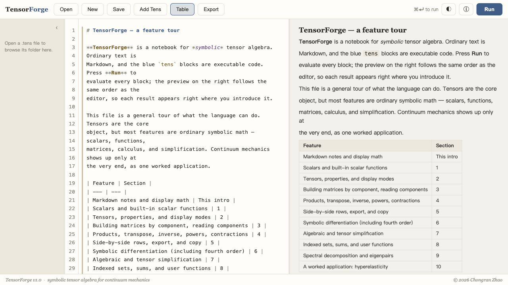

# TensorForge

Rigorous symbolic tensor algebra for finite-deformation continuum mechanics,
driven by a small declarative `.tens` DSL.



## Install

```sh
brew install --cask Chongran-Zhao/tensorforge/tensorforge
```

Homebrew requires the full `owner/tap/cask` form for untapped casks.
`brew install --cask Chongran-Zhao/tensorforge` is only a tap reference, not an
installable app cask.

## Update

```sh
brew update
brew upgrade --cask tensorforge
```

## Release Preparation

Before tagging a release, update all version-bearing files from one entry point:

```sh
scripts/prepare-release.sh 1.1.0
```

If you are rendering the checked-in Homebrew cask manually, pass the built DMG
checksum:

```sh
scripts/prepare-release.sh 1.1.0 --sha256 <64-hex-sha>
```

The GitHub release workflow still computes the real DMG checksum and renders the
tap cask automatically when a `v*` tag is pushed.

## Editor

Markdown blocks use native spellcheck for English prose while keeping automatic
text replacement off, so source-like input such as `---` and LaTeX stays literal.
At the start of a Markdown line, type `/` for slash-command completions such as
`/h1`, `/bold`, `/math`, `/table`, and `/hr`; press `Tab` or, after typing part
of a command, `Enter` to accept.
The toolbar `Markdown` menu inserts common blocks, configurable tables, and
math-array diagram templates such as logic trees and three-case comparison
charts.

## Functions

| Function | Use |
|---|---|
| `Scalar("\mu")` | Declare a symbolic scalar. |
| `Tensor("\bm F", order=2, dim=3, ...)` | Declare a tensor. Keyword args: `order`, `dim`, `identity`, `symmetric`, `antisymmetric`, `orthogonal`, `isotropic`. |
| `Det(A)` | Symbolic determinant. |
| `Tr(A)` | Symbolic trace. |
| `Inv(A)` | Symbolic tensor inverse. |
| `log(x)`, `sqrt(x)`, `exp(x)`, `sin(x)`, `cos(x)`, `tan(x)` | Symbolic scalar functions. |
| `sinh(x)`, `cosh(x)`, `tanh(x)` | Symbolic scalar hyperbolic functions. |
| `Var("x")`, `Function("y", x)`, `Function("u", x, y, t)` | Declare independent variables and unknown scalar functions for ODE/PDE-style expressions. |
| `A * B` | Scalar multiplication, tensor scaling, or second-order tensor product / single contraction. |
| `A & B` | Tensor product `A \otimes B`. |
| `A : B` | Standard double contraction. |
| `ScalarSet("\lambda", dim=3)`, `VectorSet("\bm N", dim=3)` | Indexed families; elements `lambda[a]`, `N[1]`. |
| `Sum(expr, a)` | Symbolic sum over a set index. |
| `F[1][1] = expr` | Assign tensor components (unset entries are zero). |
| `[lambda, N] = Spectral(C, "\lambda", "\bm N")` | Declare paired symbolic eigenvalue/eigenvector sets for `C`. |
| `[c, N] = Spec_Decomp(C)` | Symbolic eigendecomposition of a diagonal component-filled tensor. |
| `Diff(expr, X, order=1)` | Evaluated derivative of explicit scalar/tensor expressions. `order` repeats the derivative. |
| `Derivative(f, x, order=1)` | Formal derivative or partial derivative of an unknown `Function(...)`. |
| `Equation(lhs, rhs)` | Declare a scalar equation object. |
| `Integrate(expr, x)`, `Integral(expr, x)` | Rule-based scalar integration, with a formal `Integral(...)` fallback when unsupported. |
| `ODE(eq, y, x, BoundaryCondition(...))` | Declare an ODE/PDE problem object. The boundary condition is optional. |
| `BoundaryCondition(y(x0), y0)` | Boundary/initial condition used by supported ODE solvers. |
| `ode.show()` | Output the equation and boundary-condition status. |
| `ode.classify()` | Output ODE/PDE type, order, linearity, homogeneity, subtype, and reasons. |
| `ode.solve()`, `ode.solve(details=true)` | Solve supported first-order linear, separable, and exact ODEs. |
| `Simplify(expr, rules=...)` | Exact rewriting. Rule sets: `algebra`, `tensor`, `continuum`. |
| `expr.show()` | Render symbol mode output in the app. |
| `expr.show(matrix)`, `expr.show(components)`, `expr.show(block_components)` | Render a specific output mode. |

Operators: `+`, `-`, `*`, `/`, `^`, `A & B`, `A : B`, and `A.T`.

## Current Scope

TensorForge intentionally favors strict symbolic tensor algebra over broad CAS
coverage. When a rule is not implemented, the app reports a source-line error
instead of guessing.

Current 1.x limits:

- The DSL is the source of truth; TensorForge does not parse arbitrary LaTeX,
  Python, Mathematica, or Maple expressions.
- `Matrix` and `Vector` are not separate public DSL constructors yet. Use
  `Tensor(..., order=2, ...)` and `VectorSet(...)` / order-1 tensor values where
  supported.
- General `contract(A, B, indices=...)` is not implemented yet. Use `*`,
  `:`, `&`, and indexed `Sum(...)` for the supported contractions.
- `.show(components|matrix)` focuses on order-1/order-2 tensors and
  explicit diagonal/spectral cases. Unsupported inverse, outer-product, or
  spectral component expansions should be shown with `.show()` / `.show(symbol)`.
- `.show(block_components)` is for supported order-4 derivative
  structures, especially tensor-by-tensor derivatives.
- Export is handled by the app toolbar `Export` button, not by a DSL command.
- Applied-math ODE support covers first-order linear, separable, and exact
  equations. Unsupported integrations remain as formal `Integral(...)` nodes,
  and unsupported solver paths return a diagnostic instead of guessing.
- PDEs and higher-order ODEs can be classified, but only first-order ODEs are
  solved in the current release.
- `Spec_Decomp(C)` currently requires a diagonal component-filled second-order
  tensor in the working basis.
- Differentiation covers the continuum-mechanics paths in the tests, including
  scalar/tensor derivatives, compound tensor denominators, spectral strain
  derivatives, and fourth-order tangents. Eigenvector derivatives and some fully
  general tensor-chain rules are deliberately rejected.

## Applied Math / ODE Example

The full runnable demo is available at `examples/applied-math-ode.tens`.
The current ODE capability reference lives in
`docs/applied-math-ode-support.md`.

```text
x = Var("x")
y = Function("y", x)

eq = Equation(Derivative(y, x) + 2*y, exp(x))
ode = ODE(eq, y, x, BoundaryCondition(y(0), 1))

ode.classify()
ode.solve(details=true)
```

Separable and exact equations are supported in the same style:

```text
x = Var("x")
y = Function("y", x)

sep = Equation(3*y^2*Derivative(y, x), cos(x))
exact = Equation((2 + x^2*y)*Derivative(y, x) + x*y^2, 0)

ODE(sep, y, x).solve()
ODE(exact, y, x, BoundaryCondition(y(1), 2)).solve()
```

## Example

```text
mu = Scalar("\mu")
kappa = Scalar("\kappa")
m = Scalar("m")
n = Scalar("n")

F = Tensor("\bm F", order=2, dim=3)
lambda = ScalarSet("\lambda", dim=3)
N = VectorSet("\bm N", dim=3)

lam = Var("\lambda")
Ecr = (lam^m - lam^(-n))/(m + n)

C = Sum(lambda[a]^2 * N[a] & N[a], a)
E = Sum(Ecr(lambda[a]) * N[a] & N[a], a)
Q = 2 * Diff(E, C)
W = mu * (E : E) + kappa/2 * Tr(E)^2

T = Diff(W, E)
S = T : Q

E.show()
Q.show()
S.show()
```

License: MIT.
