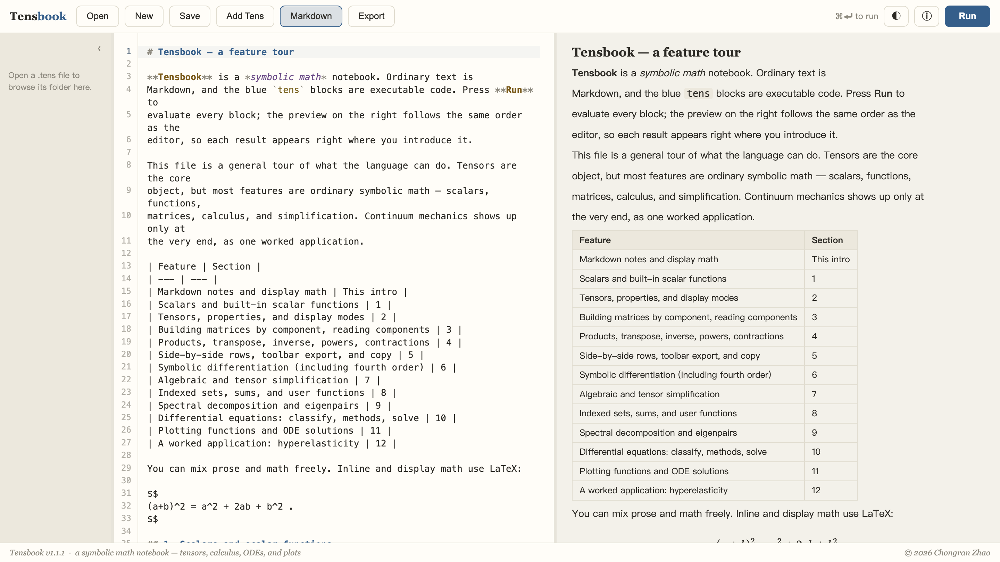

# Tensbook

[](https://github.com/Chongran-Zhao/Tensbook/actions/workflows/ci.yml)
[](https://github.com/Chongran-Zhao/Tensbook/releases)
[](#license)

A symbolic math notebook — tensor algebra, calculus, ODEs, and plots in one
plain-text `.tens` file. Markdown is prose, `tens` blocks are executable, and
the preview renders every result next to its source, so a derivation stays a
note and a reproducible calculation at once.



## Install

```sh
brew install --cask Chongran-Zhao/tensbook/tensbook   # install
brew upgrade  --cask tensbook                         # update
```

Upgrading from TensorForge 1.0? Run `brew uninstall --cask tensorforge` first.

## A taste

```text
F = Tensor("\bm F", order=2, dim=3)
C = F.T * F
[C.show(), Det(F).show()]

x = Var("x")
y = Function("y", x)
ivp = ODE(Equation(Derivative(y, x), x), y, x, BoundaryCondition(y(0), 0))
ivp.solve(details=true)

[sin(x), cos(x)].plot(-pi, pi)
```

Everything above renders live: typed tensor algebra, worked ODE solution
steps, and a themed SVG plot. The feature tour the app opens with
([examples/start.tens](examples/start.tens)) walks through all of it.

## Highlights

- **Notebook-first** — Markdown + executable blocks, source/preview split,
  `ViewSource` comparison blocks, Markdown/PDF export.
- **Typed tensor algebra** — products and contractions (`*`, `:`, `&`),
  traces, determinants, inverses, components, spectral decompositions,
  fourth-order tangents.
- **Calculus for mechanics** — evaluated `Diff` vs. formal `Derivative`;
  rule-based `Integrate` with a formal `Integral` fallback.
- **ODEs** — classification, boundary conditions, solver-method inspection,
  and worked solution steps from first order up to teaching-grade
  second-order methods.
- **Plots** — one-variable expressions, curve lists, and explicit ODE
  solutions.
- **No guessing** — unsupported math returns a diagnostic or a formal
  object, never a silent approximation.

## Reference

The full language reference — declarations, operations, display modes, and
the precise scope of this release — lives in
[docs/language.md](docs/language.md). For the applied-math layer see
[docs/applied-math-ode-support.md](docs/applied-math-ode-support.md) and the
runnable demo [examples/applied-math-ode.tens](examples/applied-math-ode.tens).

## Development

```sh
cargo test                                            # 188 engine tests
cargo fmt --all --check
cargo clippy -p tensbook     --all-targets -- -D warnings
cargo clippy -p tensbook-app --all-targets -- -D warnings
npm run test:ui                                       # headless UI tests
cargo tauri dev                                       # run the desktop app
```

Maintainer release steps: [docs/releasing.md](docs/releasing.md).

## License

MIT.
